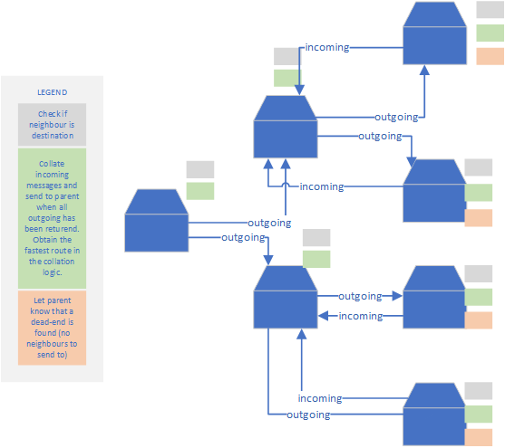
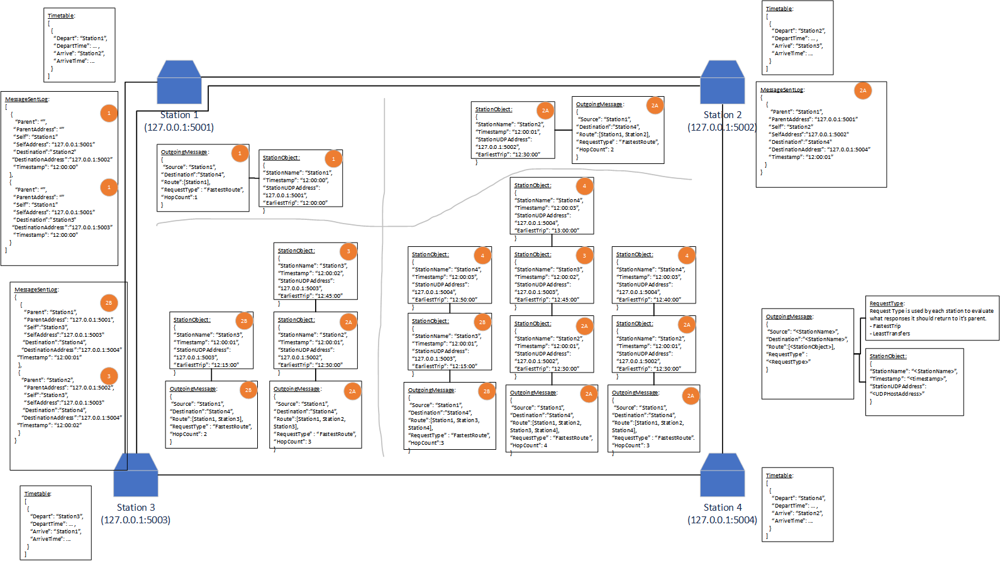

# CITS3002 Project

The goal of this project is to develop a server application to manage the data and permit queries about Transperth bus and train routes. By successfully completing the project, you will have a greater understanding of the standard TCP and UDP protocols running over IP, communication between web-browsers and application programs using HTTP and HTML, and will have developed a simple text-based protocol to make and reply to queries for distributed information.

# Operating system

Operating system: Microsoft Windows 10 Pro running Windows Subsystem for Linux (WSL).

Languages used: Python, Java

# Client (web browser) and station communcation (TCP)

TCP/IP is used for the communication between client and server. 
To faciliate client and station communication, a User Interface is created using Bootstrap, HTML, jQuery, CSS and JavaScript. 


* Simple response:
  * A simple trip response in the following format: 
  Source, SourceStop, SourceDepartTime, Vehicle, Target, TargetArrivalTime
* Detailed response: 
  * A more detailed response is included for each leg of the trip under "Trip Details". 

To submit a GET request, simply specify the following: 
```
http://127.0.0.1:<port>/?to=<stationName>
```
When using the User Interface, you can also populate the "Destination", "Departure Time" and "Type of Trip" fields which will change the GET request to as follows:
```
http://127.0.0.1:<port>/?to=<stationName&time=<time>&tripType=<tripType>
```
Note that the simple method will default to using the CurrentTime for "time" and FastestTrip for "Type of Trip". 

# Inter-station communication (UDP)

UDP/IP is used for the communication between servers.
The basic approach used for inter-station communication is as follows: 



* Outgoing: 
  * Each node will check if there is a valid timetable to the next station. 
    * If valid: adds station info to the route and send back to parent. If it is the source node, then send back to client (browser).
    * If not valid: add station info to the route and send message to neighbours. Note: it will not send message to neighbours already in route.
* Incoming: 
  * Messages that are returning to the node will be stored in a message bank until all messages with the same messageId have returned. 
  * Once all messages have returned, the station will evaluate the FastestRoute across the messages with the same messageId that it received from its neighbours.
  * The station will then send the message with the FastestRoute back to it's parent.

Notes: 
* Advanced diagram of inter-station communication included in appendix below. 

# Compiling and running server

To compile Station.java, use the following code: 
```
javac -classpath "gson-2.8.6.jar" Station.java
```

To run Station.class (Java), use the following code: 
```
java -cp .;gson-2.8.6.jar Station <stationName> <tcpPort> <udpPort> <neighbourPorts...>
```

To run station.py (Python), use the following code: 
```
python3 station.py <stationName> <tcpPort> <udpPort> <neighbourPorts...>
```

# Folder structure

* root
  * Station.java : contains the code to run the java station server
  * station.py : contains the code to run the Python station server
  * station.html : contains the html, javascript, css, jQuery to return the user interface. This is read as a string by Java, parameters are then replaced, and finally sent to the client browser. 
  * tt-(stationName) : station timetables will be in the same directory level as the code files. 
  * .gitignore : ignore local files and do not commit to the repo. 


# Appendix

### Advanced diagram:

Note that the diagrams are not 100% representative of actual communications as some things have changed since this was created, but it is close enough. 

#### Outgoing messages

#### Incoming messages
